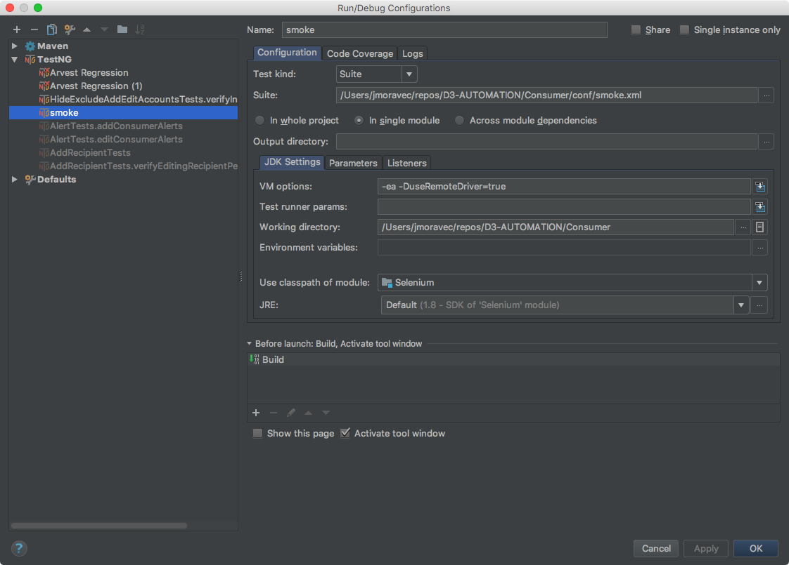
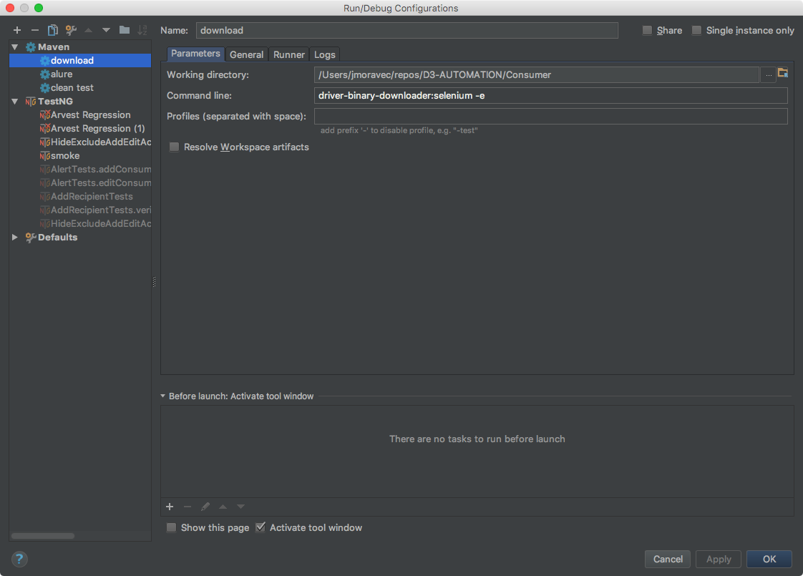

# Selenium Tests

This folder holds all of the end-to-end automated tests using Selenium.

## Setup

There are a few ways to run the tests locally

* [I just want to run the tests via a script without changing code or setting much up (Mac only)](#running-tests-via-a-script)
* [I want to run the tests using all Docker images](#running-tests-using-docker-images)
* [I want to build and run the tests in IntelliJ but run Selenium Grid in Docker](#running-tests-in-intellij-using-selenium-grid)
* [I want to build and run the tests in IntelliJ but use my computer's browser (not Grid)](#running-tests-in-intellij-using-local-selenium)
    
If you're unsure which one to chose, they are in general order of easiest to hardest to setup. 
However, if you're writing tests, you'll eventually want to setup the last one for debugging purposes.

## Requirements for all methods

1. Install git and have Github access to the [D3-AUTOMATION](https://github.com/LodoSoftware/D3-AUTOMATION) repo
1. If you want to edit the tests install [IntelliJ](https://www.jetbrains.com/idea/download/)

### Running tests via a script

Running the smoke suite on a Mac is simple:

In a terminal application, run the following (fill in the first command with where you cloned the repo)
    
    cd ~/path/to/.../D3-AUTOMATION
    cd Consumer
    ./run-tests.sh

This script does the following:

1. Install Homebrew if it isn't already installed
1. Install Homebrew cask
1. Install allure command line (for test reports)
1. Install docker and docker-toolbox (to run tests)
1. Builds and runs the tests inside a docker container, while Selenium is running on docker containers in a grid setup
1. Opens up the pages necessary to watch the tests being run (The page is set to reload every 10 seconds, but you may need to reload it manually to see the current test)
1. After the tests are done (current smoke runs at about 20-25 minutes), opens up the page to see the videos for each test class, as well as the Allure test report

From this point you have to type Control-c to stop serving the Allure report, and the script will ask if you would like to backup the videos generated from the tests or not
Select the number associated with your choice and the script is done!

### Running tests using Docker images

Tested using macOS and Ubuntu 17.04

#### Requirements
1. Install the latest Community Edition of [Docker](https://www.docker.com/)
1. Install docker-compose (Linux only)

Optional:
1. Allure reporting [command line tool](https://allure-framework.github.io/allure-docs/latest/#_installing_a_commandline)

#### Instructions

Run the following commands (current dir needs to be D3-AUTOMATION/Consumer)

    mkdir -p Reports/videos
    docker pull elgalu/selenium
    
    # Only need to run this 1 time, unless there are changes to the pom.xml or Dockerfile
    docker-compose build
    
    # You can remove the -d to see the Selenium logs, but you'll have to have another terminal open to run the tests
    docker-compose up -d zalenium
    
    docker-compose run --rm d3tests
    
While the tests are running, go to http://localhost:4444/grid/admin/live?refresh=10 to watch the tests being run
http://localhost:5555 will show you the videos of the tests once they are done

After the tests are done, you can run `docker-compose stop` to kill the Selenium Grid
To see the Allure report (from the `Consumer` directory):

    allure serve target/allure-results

### Running tests in IntelliJ using Selenium Grid

#### Requirements

1. Install the latest Community Edition of [Docker](https://www.docker.com/)

Optional:
1. Allure reporting [command line tool](https://allure-framework.github.io/allure-docs/latest/#_installing_a_commandline)

#### Instructions

Run the following commands (current dir needs to be D3-AUTOMATION/Consumer)

    mkdir -p Reports/videos
    docker pull elgalu/selenium
    
    # You can remove the -d to see the Selenium logs, but you'll have to have another terminal open to run the tests
    docker-compose up -d zalenium 

In IntelliJ: 

1. Edit the default TestNG run configuration. 
1. In the JDK Settings, add a VM option: `-DuseRemoteDriver=true`

You should now be able to run any test via the green arrow next to the code

If you would like to run the whole suite:

1. Create a new TestNG Run configuration
1. Set it to Suite
1. Suite should be pointed to `/[repo path]/Consumer/conf/smoke.xml`
1. Set the Working directory to `[repo path]/Consumer`

### Running tests in Intellij using local Selenium

#### Requirements

1. Install Chrome

Optional:
1. Allure reporting [command line tool](https://allure-framework.github.io/allure-docs/latest/#_installing_a_commandline)

#### Instructions

In IntelliJ:

1. Create a new Maven Run configuration
1. Set the Working directory to `[repo path]/Consumer`
1. Set the Command line to be `driver-binary-downloader:selenium -e`
1. Set the Name to be `Download Drivers` (or something similar)

Run this new maven goal (it downloads the necessary webdriver components to the correct areas)

You should now be able to run any test via the green arrow next to the code

If you would like to run the whole suite:

1. Create a new TestNG Run configuration
1. Set it to Suite
1. Suite should be pointed to `/[repo path]/Consumer/conf/smoke.xml`
1. Set the Working directory to `/[repo path]/Consumer`

If you would like to run tests individually:
1. For IntelliJ:
    - Run > Edit Configurations > Defaults > TestNG > Listeners > Add `com.d3.tests.listeners.ProjectListener`
1. For Eclipse:
    - Window > Preferences > TestNG > Template XML File > Browse > Set to `smoke.xml` file location

